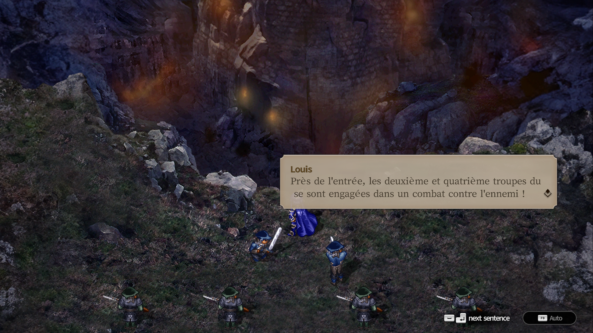
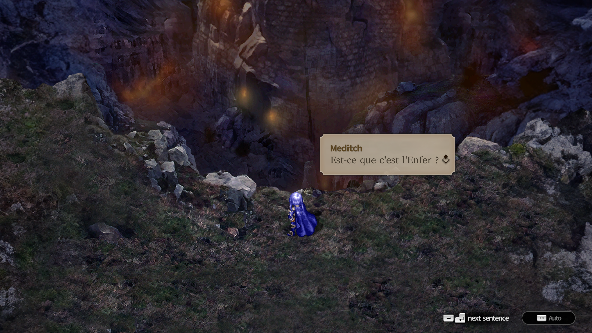
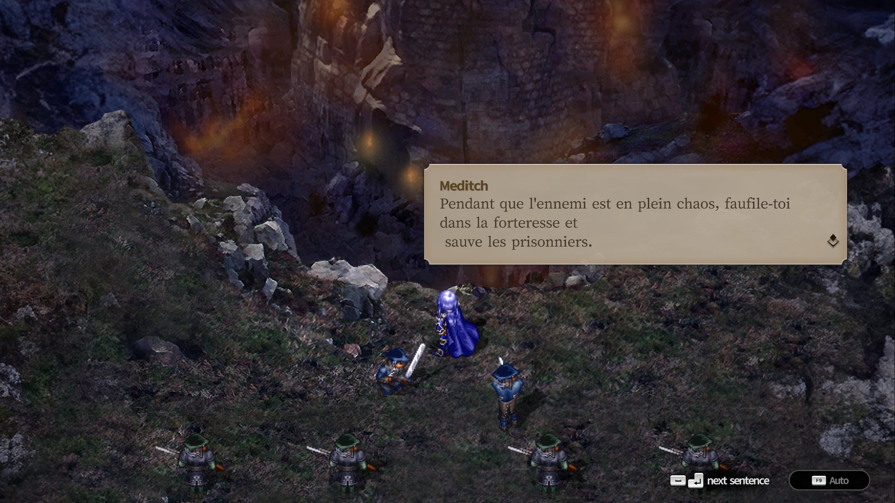

# The-Rhapsody-of-Zephyr-Remastered-Steam-
En Coréen seulement, j'ai fait un patch bêta en français!

## À propos

Projet de traduction française de la version *Steam**.

## Soutien

Si vous appréciez mes projets de traduction et souhaitez soutenir mon travail :

## Installation

1. Procurez-vous votre propre copie du jeu original **The-Rhapsody-of-Zephyr-Remastered** sur Steam
2. Téléchargez le dernier patch de traduction française depuis la page [[Releases](../../releases)](https://store.steampowered.com/app/5099430/_/).
3. Simplement placer ZephyrRemastered_Data dans le dossier et tout remplacer.
4. Lancez le jeu .

> ⚠️ Le jeu original n'est pas inclus dans ce projet.

## Captures d'écran

  
  

  
  

  
  

  
  

## Crédits

* Traduction & Hacking : 1vierock

## Changelog

### v1.1
* Fix les accents
### v1.0
* Création du projet

